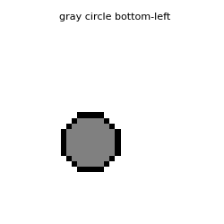
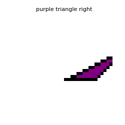
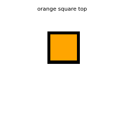
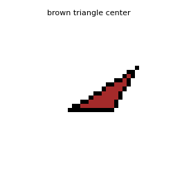
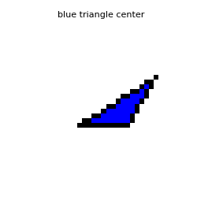

# nanovlm_from_scratch

A tiny VLM-from-scratch project: train a small CLIP-style model (~1M params) on a synthetic dataset of colored shapes.
It uses:
- CNN image encoder -> 64-d embedding
- Text encoder (token + positional embeddings + Multi-Head Attention) -> 64-d embedding
- Contrastive (CLIP) loss for image<->text alignment

## Structure
* `models/image_encoder.py` - CNN encoder
* `models/text_encoder.py` — tiny attention-based text encoder
* `losses/clip_loss.py` — symmetric CLIP loss (image->text and text->image)
* `scripts/synthetic_data_generator.py` — dataset generator
* `scripts/train.py` — training loop

## Dataset
### Synthetic dataset samples
Added caption text to the image as title:







Generated on-the-fly in `scripts/synthetic_data_generator.py`.

## Install
```bash
python -m venv .venv
source .venv/bin/activate
pip install -r requirements.txt
```

## Train
```bash
python -m scripts.train
```
